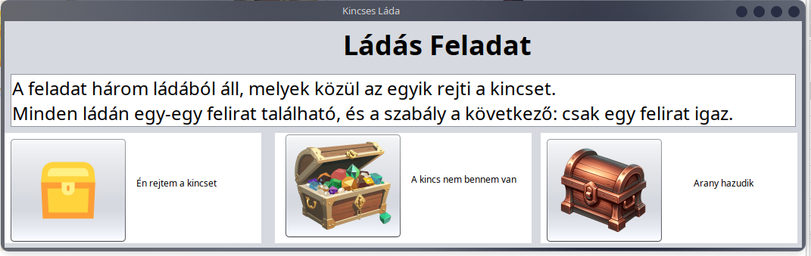

# Három Kincses Láda

## Feladat
A feladat három ládából áll, melyek közül az egyik rejti a kincset. Minden ládán egy-egy felirat található, és a szabály a következő: **csak egy felirat igaz**.

### Ládák és Felirataik
- **Arany láda**: "Én rejtem a kincset."
- **Ezüst láda**: "Nem én rejtem a kincset."
- **Bronz láda**: "Az arany láda hazudik."

A feladat megoldása során meg kell határozni, melyik láda rejti a kincset a feliratok és a szabály alapján.

Ha a user rákattint valamelyik ládára akkor egy felugró ablak tájékoztatja hogy eltalálta e vagy se, ezüst az fix üres, viszont véletlenszerű az eldöntés hogy a bronzba vagy az aranyban van e a kincs
